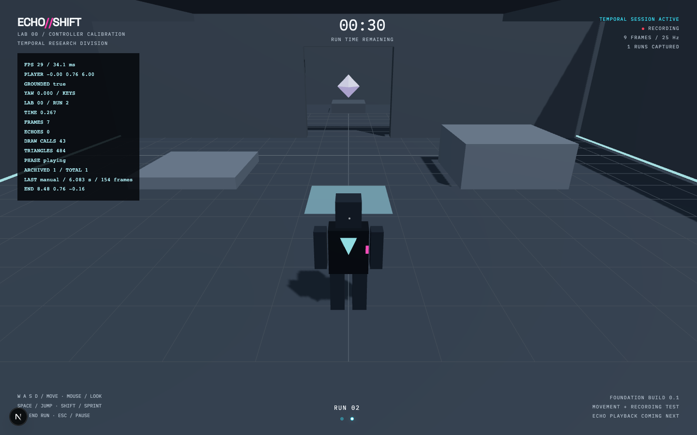
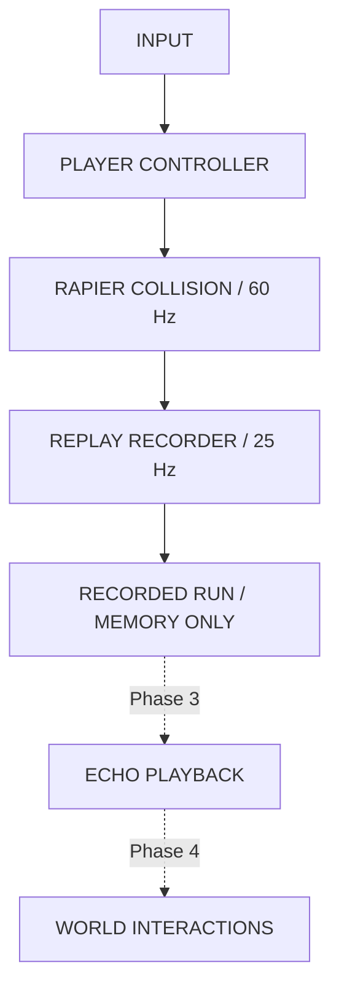

# ECHO//SHIFT

**Your past remains. Cooperate with it.**

A frontend-only, third-person temporal puzzle game. Each run records what the player actually does. Previous runs will become holographic echoes that replay those decisions and cooperate with the current player.

The timeline lives only in browser memory. Refreshing or closing the window destroys it. No accounts, storage, backend, or cloud saves.

The foundation currently owns the timeline inside the mounted game route. Leaving that route ends calibration; re-entering starts a new timeline.

## Current build: Phases 1 + 2

This is the verified **movement and recording foundation**, not the finished game. The chamber is intentionally grey-boxed. Echo playback, interactive plates/doors, and the six-chamber campaign have not been implemented yet. The floor marker, open doorway, and prism reserve space for the first cooperative puzzle; they do not simulate puzzle logic.



Screenshot of the running application after capturing a real movement sequence and resetting to run 2. The telemetry shows the archived endpoint; no echoes have been rendered yet.

Implemented:

- Fixed-step Rapier collision, grounded jumping, sprint, acceleration/deceleration, and camera-relative movement.
- Third-person follow camera with wall avoidance and pointer-lock mouse input.
- Exact-timestamp replay recording on a 25 Hz grid, with position, quaternion rotation, velocity, and animation.
- Independent deterministic action event data, ready for puzzle interactions.
- Manual partial-run capture and automatic 30-second capture, with precise endpoints.
- A six-recording in-memory archive, pause/focus handling, confirmed timeline restart, and refresh cleanup.
- Minimal session landing, loading/error screens, controls, HUD, camera settings, and desktop-only gameplay notice.
- Automated unit and real-browser integration checks.

## Local development

Use Node.js 24. Node 22 (22.12 or newer) and Node 26+ are also supported by the installed test runner.

```bash
npm ci
npm run dev
```

Open `http://localhost:3000`, select **ENTER THE LOOP**, then **BEGIN CALIBRATION**. Mouse capture requires a direct click in a desktop browser. Use localhost or HTTPS.

```bash
npm run typecheck
npm run lint
npm test
npm run build
```

Browser checks use Playwright Chromium and exercise WebGL, physics, pointer lock, jumping, collision, pauses, captures, restart, refresh, and the mobile notice:

```bash
npx playwright install chromium
npm run test:browser
```

The development server starts automatically, or an existing localhost:3000 server is reused. Browser tests use the development-only telemetry panel. They must not target a production server. The renderer needs a working WebGL2 implementation; software renderers can be slower than normal desktop gameplay.

Current verification: strict TypeScript, ESLint, production build, 27 unit tests, and three browser tests pass. Browser capture tests observe actual simulation and recordings; they do not inject scripted player paths or mock physics.

## Controls

| Input | Action |
| --- | --- |
| W / A / S / D | Camera-relative movement |
| Mouse | Orbit camera while captured |
| Space | Jump when grounded |
| Shift | Sprint |
| R | Capture current run and reset |
| Esc | Pause and release mouse |
| Backtick | Development-only telemetry |

The pause panel includes sensitivity, invert Y, reduced camera motion, current-run reset, and confirmed timeline restart. Music/SFX/graphics controls are deferred until their systems exist. E interaction is reserved for Phase 4.

## Architecture

```text
src/app/                    Next.js routes and document
src/components/             DOM HUD, overlays, error handling
src/game/core/              Simulation clock and mounted game runtime
src/game/player/            Input, movement, Rapier body, camera, replaceable model
src/game/replay/            Serializable run types, fixed-rate recorder, bounded archive
src/game/environment/       Grey-box collision chamber
src/game/state/             Zustand phase machine and low-frequency UI snapshots
tests/browser/              Real Chromium integration checks
```



The game runtime owns frame-level mutable data. React manages structure and phase transitions; it never receives player transforms every frame. Zustand publishes HUD telemetry at roughly 10 Hz. A narrow lint exception permits intentional imperative mutations in the two physics/camera components while retaining React rules for the UI.

The phase machine rejects invalid transitions. Blur, pointer-lock loss, and hidden tabs pause simulation and clear held inputs. A reset freezes simulation, captures once, waits 1.2 seconds, resets the player/clock/recorder, and resumes only if mouse capture and document visibility are intact.

## Recording design

Physics supplies timestamped observations. The recorder resamples between adjacent observations onto exact `sampleIndex / 25` timestamps, using linear position/velocity interpolation and shortest-arc quaternion slerp. It does not attach an old timestamp to a newer position or assume render FPS matches sampling FPS.

The initial frame is at time zero. A partial recording adds its precise final pose even when the endpoint falls between sample ticks. Playback will hold this endpoint through the rest of the run; this is essential for deliberately short pressure-plate runs. **That playback behavior is the next milestone, not implemented in this build.**

Actions have their own ordered event stream, separate from transform samples, so a brief switch activation cannot disappear between sample ticks. Stable entity IDs and explicit cube drop coordinates are represented in the schema. Current movement calibration does not fabricate entity events.

Completed recordings retain only plain serializable numbers and labels, never Three.js or Rapier objects. Capture is idempotent. The archive retains at most six recordings, evicting the oldest while preserving original run IDs. Restart clears every recording. A 60-second run at 25 Hz has 1,501 frames including time zero; an off-grid manual endpoint can add one extra frame.

## Performance decisions

- Fixed 60 Hz simulation, independent 25 Hz recording, and throttled HUD updates.
- Imperative transform/model animation updates; no per-frame React state updates.
- A single shadow-casting light, capped 1.5 DPR, modest shadow resolution, and primitive geometry.
- Reused camera vectors/raycaster and recorder quaternion scratch objects.
- Bounded archive memory and cleaned-up input listeners, timers, and Rapier character controller.
- Lazy-loaded game renderer. No remote models/textures are needed to initialize gameplay.
- Cosmetic Google web fonts have system fallbacks; simulation has no external API dependency.

60 FPS with the final environment and multiple echoes is a target, not a measured claim for this foundation. Broad GPU/browser profiling belongs to Phase 11.

## Deployment

Import the repository into Vercel as a Next.js project. The normal `npm run build` command prerenders `/` and `/game`; gameplay runs on the client. No environment variables, API routes, database, or server-side game state are required. `npm run build && npm start` serves the local production build.

## Known limitations and next milestone

- No echo rendering/playback yet. The next task is to render actual recorded paths with timestamp interpolation, then prove the one-plate/one-door puzzle before creating any further levels.
- No campaign, scoring, completion sequence, final art, advanced reset effects, spatial audio, or postprocessing yet.
- Primitive operative and laboratory are intentional replaceable grey-box assets.
- Desktop Chromium has been exercised; Safari/Firefox/Edge validation remains outstanding.
- Current R3F emits one upstream Three.js Clock deprecation warning; Rapier emits one WASM initializer deprecation warning. These are not application errors and are not suppressed.
- Mobile gameplay is intentionally unavailable. WebGL2 is the current Three.js baseline.

See [PROGRESS.md](PROGRESS.md) for milestone status and architecture decisions. Git commits preserve the verified development sequence.
