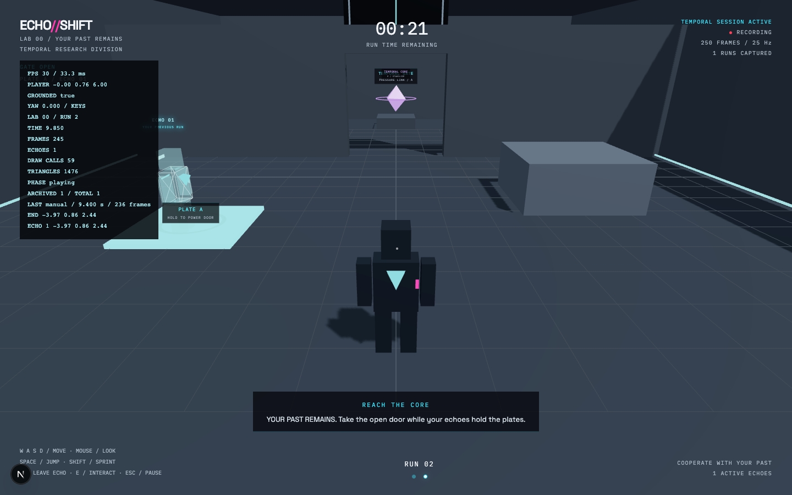
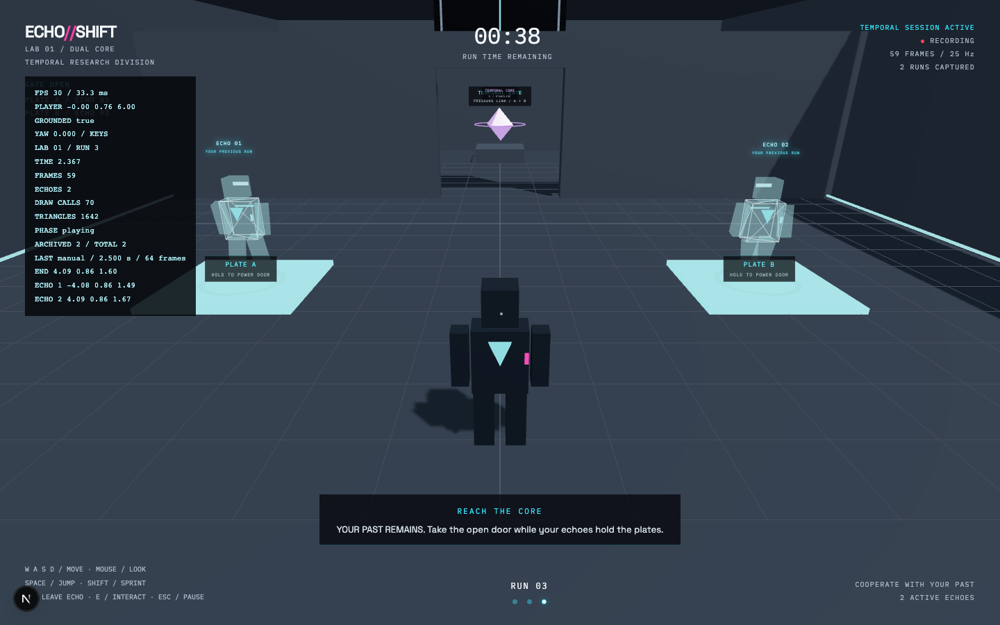
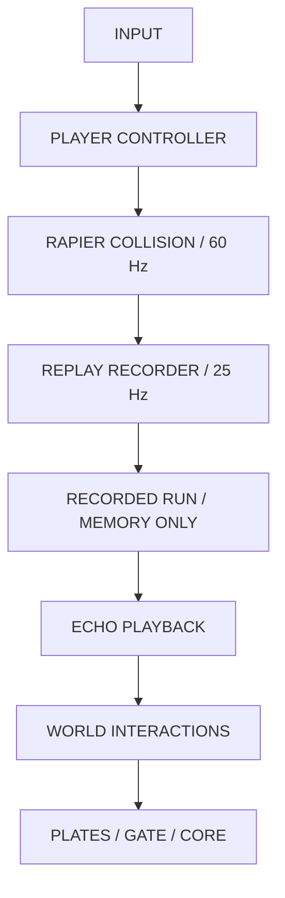

# ECHO//SHIFT

**Your past remains. Cooperate with it.**

A frontend-only, third-person temporal puzzle game. Each run records what the player actually does. Previous runs become holographic echoes that replay those decisions and cooperate with the current player.

The timeline lives only in browser memory. Refreshing or closing the window destroys it. No accounts, storage, backend, or cloud saves.

The mounted game route owns the timeline. Leaving that route ends the session; re-entering starts a new timeline.

## Current build: two playable cooperative chambers

The core mechanic is playable: **record yourself, reset, cooperate with your actual past self, reach the core**. Both chambers have physical gates, shared pressure plates, evolving hints, time limits, and completion screens. The environment remains deliberately simple while the full five-level campaign is developed.





Screenshots are captured from actual browser playthroughs. Every hologram follows a run made through keyboard controls during that session; none are pre-scripted.

Implemented:

- Fixed-step Rapier collision, grounded jumping, sprint, acceleration/deceleration, and camera-relative movement.
- Third-person follow camera with wall avoidance and pointer-lock mouse input.
- Exact-timestamp replay recording on a 25 Hz grid, with position, quaternion rotation, velocity, and animation.
- Timestamp-based echo playback, interpolated position/quaternion rotation, shared character geometry, transparent cyan silhouettes, and precise final-pose holding.
- Independent deterministic action event data, ready for puzzle interactions.
- Manual partial-run capture and automatic 30/40-second capture, with precise endpoints.
- A six-recording in-memory archive, pause/focus handling, confirmed timeline restart, and refresh cleanup.
- Shared pressure plate occupancy, physical gate collision, contextual E interaction, evolving tutorial hints, and two-chamber progression.
- Session landing, loading/error screens, controls, HUD, camera settings, reset effect, completion statistics, and desktop-only gameplay notice.
- Automated unit and real-browser integration checks.

## Local development

Use Node.js 24. Node 22 (22.12 or newer) and Node 26+ are also supported by the installed test runner.

```bash
npm ci
npm run dev
```

Open `http://localhost:3000`, select **ENTER THE LOOP**, then **BEGIN EXPERIMENT**. Mouse capture requires a direct click in a desktop browser. Use localhost or HTTPS.

## How to play

**Your Past Remains / 30 seconds per run:** Walk onto the cyan plate on the left. The gate opens while you stand there, but closes when you leave. Press R while standing still on the plate. On run 2, your echo repeats your route and remains on the plate at its endpoint. Pass the powered gate, approach the violet core, and press E.

**Dual Core / 40 seconds per run:** Continue from the first chamber's victory screen. The gate now requires both plates at once. Record run 1 ending on Plate A. Record run 2 ending on Plate B. On run 3, both past selves hold their plates while you reach the core.

Challenge: finish both chambers in **five total loops**. Extra runs are allowed, with up to six active echoes. Endpoints only hold where you actually ended the recording; resetting elsewhere does not magically move an echo onto a plate.

```bash
npm run typecheck
npm run lint
npm test
npm run build
```

Browser checks use Playwright Chromium and exercise WebGL, physics, pointer lock, jumping, collision, pauses, captures, restart, refresh, and the mobile notice:

```bash
npx playwright install chromium
npm run test:browser
```

The development server starts automatically, or an existing localhost:3000 server is reused. Browser tests use the development-only telemetry panel. They must not target a production server. The renderer needs a working WebGL2 implementation; software renderers can be slower than normal desktop gameplay.

Current verification: strict TypeScript, ESLint, production build, 49 unit tests, and four browser tests. The cooperative browser playthrough solves both chambers in five loops using real keyboard movement, checks closed-door collision, waits for actual echo endpoints, activates both cores, and verifies a clean restart. It does not teleport actors or inject scripted ghost paths.

## Controls

| Input | Action |
| --- | --- |
| W / A / S / D | Camera-relative movement |
| Mouse | Orbit camera while captured |
| Space | Jump when grounded |
| Shift | Sprint |
| R | Capture current run and reset |
| E | Stabilize the core when nearby and powered |
| Esc | Pause and release mouse |
| Backtick | Development-only telemetry |

The pause panel includes sensitivity, invert Y, reduced camera motion, current-run reset, and confirmed timeline restart. Music/SFX/graphics controls are deferred until their systems exist.

## Architecture

```text
src/app/                    Next.js routes and document
src/components/             DOM HUD, overlays, error handling
src/game/core/              Simulation clock and mounted game runtime
src/game/player/            Input, movement, Rapier body, camera, replaceable model
src/game/replay/            Recorder, timestamp playback, rendered echoes, bounded archive
src/game/entities/          Deterministic puzzle world, pressure plates, physical door, core
src/game/levels/            Stable-ID chamber definitions and progression tests
src/game/environment/       Grey-box collision chamber
src/game/state/             Zustand phase machine and low-frequency UI snapshots
tests/browser/              Real Chromium integration checks
```



The game runtime owns frame-level mutable data. React manages structure and phase transitions; it never receives player transforms every frame. Zustand publishes HUD telemetry at roughly 10 Hz. A narrow lint exception permits intentional imperative mutations in the two physics/camera components while retaining React rules for the UI.

The phase machine rejects invalid transitions. Blur, pointer-lock loss, and hidden tabs pause simulation and clear held inputs. A reset freezes simulation, captures once, waits 1.2 seconds, resets the player/clock/recorder, and resumes only if mouse capture and document visibility are intact.

## Recording design

Physics supplies timestamped observations. The recorder resamples between adjacent observations onto exact `sampleIndex / 25` timestamps, using linear position/velocity interpolation and shortest-arc quaternion slerp. It does not attach an old timestamp to a newer position or assume render FPS matches sampling FPS.

The initial frame is at time zero. A partial recording adds its precise final pose even when the endpoint falls between sample ticks. Playback holds this endpoint through the rest of the run, enabling deliberately short pressure-plate runs. Binary search supports arbitrary timestamps; position/velocity use lerp and rotation uses shortest-arc slerp. Each echo uses an independent playback instance.

Actions have their own ordered event stream, separate from transform samples, so a brief activation cannot disappear between sample ticks. Playback dispatches crossed timestamps once, catches up after skipped frames, and rewinds cleanly. Stable entity IDs and explicit cube drop coordinates are represented in the schema. Core activation is recorded; cube/switch entities are future campaign mechanics.

The shared world evaluates player and echo occupancy identically, using collision-resolved player transforms and sampled echo transforms. Echoes have no physical bodies, so they never block one another or the player. Both Dual Core requirements must remain occupied simultaneously. Only the current player can complete a chamber; past core activation events cannot auto-win it.

Completed recordings retain only plain serializable numbers and labels, never Three.js or Rapier objects. Capture is idempotent. The archive retains at most six recordings, evicting the oldest while preserving original run IDs. Changing chambers discards that chamber's echoes while preserving session totals. Restart clears every recording and all totals. A 60-second run at 25 Hz has 1,501 frames including time zero; an off-grid manual endpoint can add one extra frame.

## Performance decisions

- Fixed 60 Hz simulation, independent 25 Hz recording, and throttled HUD updates.
- Imperative transform/model animation updates; no per-frame React state updates.
- A single shadow-casting light, capped 1.5 DPR, modest shadow resolution, and primitive geometry.
- Reused camera vectors/raycaster and recorder quaternion scratch objects.
- Bounded archive memory and cleaned-up input listeners, timers, and Rapier character controller.
- Lazy-loaded game renderer. No remote models/textures are needed to initialize gameplay.
- Cosmetic Google web fonts have system fallbacks; simulation has no external API dependency.

60 FPS with the final environment and multiple echoes is a target, not a measured claim for this foundation. Broad GPU/browser profiling belongs to Phase 11.

## Deployment

Import the repository into Vercel as a Next.js project. The normal `npm run build` command prerenders `/` and `/game`; gameplay runs on the client. No environment variables, API routes, database, or server-side game state are required. `npm run build && npm start` serves the local production build.

## Known limitations and next milestones

- Two chambers are playable. The remaining cube relay, timed security, and final multi-echo choreography are still to be built.
- Final facility art, spatial audio, postprocessing, and advanced reset effects remain unfinished.
- Primitive operative and laboratory are intentional replaceable grey-box assets.
- Desktop Chromium has been exercised; Safari/Firefox/Edge validation remains outstanding.
- Current R3F emits one upstream Three.js Clock deprecation warning; Rapier emits one WASM initializer deprecation warning. These are not application errors and are not suppressed.
- Mobile gameplay is intentionally unavailable. WebGL2 is the current Three.js baseline.

See [PROGRESS.md](PROGRESS.md) for milestone status and architecture decisions. Git commits preserve the verified development sequence.
